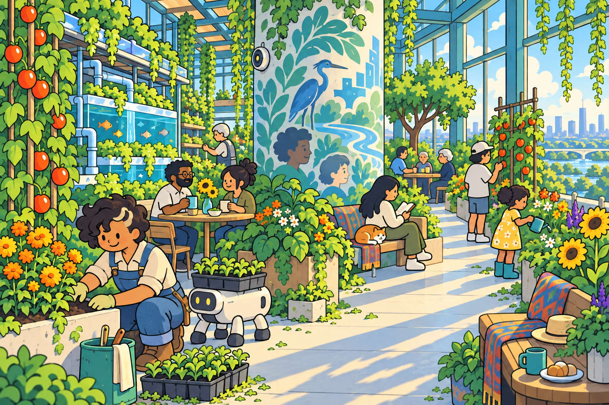

# Arcology Storybook — illustration style guide

**Status: approved standing art direction, version 1.0.** Approved by the author on September 13, 2026, in response to `mel-atrium-simplified-v2.png`: “This is the style from here on out.”

Use this direction for new Arcology illustrations and future revisions of existing illustrations. The approved image below is the controlling visual reference. The outside inspiration and the first, more anatomically realistic illustrated attempt are historical development material. When a written description leaves room for interpretation, match this approved image.

Reference: [approved master PNG](art/reference/mel-atrium-simplified-v2.png), 1536 × 1024, landscape 3:2. Keep this master unchanged. Use the [reusable illustration prompt](art/arcology-illustration-prompt.md) with the reference attached for future image work.

## The style in one paragraph

Arcology Storybook is a warm, colorful, deliberately cute form of illustrated solarpunk. Compact people with rounded bodies and simple, expressive faces share lush, sunlit places with useful, characterful machines. Confident dark contours enclose broad areas of color, with a little texture and a few clear shadow shapes. Plants, clothes, faces, furniture, and robots all use the same simplified drawing language. The world feels abundant through many readable activities and objects: a shared meal, a seedling tray, a cat beside a reader, water moving through a planted room. The extraordinary city becomes approachable through everyday life.

## 1. People: simplify their construction

Body shape is the most important consistency rule. Construct the person as a cartoon from the beginning. Merely outlining realistic anatomy will reproduce the rejected first attempt.

- Use slightly oversized heads, short torsos, soft shoulders, rounded joints, sturdy or gently tubular limbs, and broad, blunt shoes. A useful starting target is roughly **four to five heads in standing height**, with four to four-and-a-half as the original prompt's center of gravity. This is a drawing heuristic, not a measured specification or a requirement that every resident share a body type.
- Give each person a distinct silhouette through height, build, posture, hair, and clothing. Allow roundness, asymmetry, awkwardness, and ordinary physical variation.
- Build a pose around one readable gesture: tending, reaching, listening, resting, carrying, or turning toward someone. Keep the relationship between person and task clear.
- Hands can be mitten-like forms with a thumb and a few purposeful separations. Fingers need only as much articulation as the activity requires. Feet and footwear are rounded, generous shapes.
- Faces use small dark oval or dot eyes, a tiny nose or simple profile projection, and one mouth mark. Add sparse eyebrows or age cues when useful. Expressions should read from a few marks.
- Hair is a recognizable mass: scalloped curls, a rounded crop, a ponytail, or one flowing shape. Use a few internal divisions and selected tufts. Mel's pale forelock against dark curls is an effective identifying mark.
- Clothes have large, clear panels of color, a small number of folds, and a few seams or fastenings. Everyday overalls, loose shirts, comfortable trousers, dresses, and practical boots belong naturally here.

Preserve adulthood where the story calls for adults. Clothing, context, posture, size differences, and sparse signs of age can establish it within these cute proportions. Do not gradually replace the approved small facial marks with glossy oversized eyes or elaborate beauty-illustration faces. The softness and cuteness of the approved image are intentional.

## 2. Robots and embodied AI: big forms, clear purpose

Design each machine from two or three dominant geometric masses, then add only the details needed to explain its behavior. Rounded capsules, breadbox bodies, simple panels, short tubes, broad feet, and a few circular components fit this language.

The approved garden robot is a construction reference: a squat cream capsule, a dark rounded face panel with two yellow indicators, four short legs ending in chunky dark feet, and a broad tray of seedlings. Its task is legible immediately. Its appeal comes from proportion and gesture.

Keep joints diagrammatically simple. Omit tiny screws, elaborate servos, layered armor, cables, precision-machined surfaces, and dense component seams unless a particular illustration needs to explain one component. Even then, keep the shapes graphic.

The garden robot is **one design**, not a mandatory body for every AI. Speakers, public interfaces, shared bodies, humanoid bodies, and unfamiliar forms should each retain this visual simplification while reflecting their actual role. Do not add eyes or a smiling face to every machine. A device's appearance does not establish whether it is an AI person, an extension of someone, or an automated tool.

Show agency through activity, attention, personal choices, and relationships. Cute bodies can belong to autonomous adults. The illustration's style does not establish that Mel's garden helper is Pell; use the story's confirmed form of presence in each scene.

## 3. Linework, color, and light

**Linework:** confident dark ink contours with a slight organic irregularity. Stronger outlines describe foreground silhouettes; lighter, thinner lines describe distant objects and selected interior details. Keep the result clean and drawn, with occasional small variations rather than mechanical uniformity or scratchy sketching.

**Color:** broad, well-separated color areas. Greens and blue-greens carry the planted world; warm cream and pale yellow bring light; blue and indigo anchor clothing and structure; orange, gold, and occasional lilac provide small accents. Keep individual skin tones distinct and suitable to the residents, rather than recoloring everyone to fit an environmental palette.

These are approximate art-direction swatches chosen to describe the approved image, not sampled color standards or new website CSS tokens:

| Role | Suggested starting color |
| --- | --- |
| Contour ink | `#283139` — soft charcoal |
| Sunlit cream | `#F6E5AE` — warm pale yellow |
| Fresh foliage | `#B4CF43` — lively yellow-green |
| Middle foliage | `#65974B` — leaf green |
| Deep foliage | `#356952` — shaded green |
| Glass and water | `#58B8D0` — clear cyan |
| Painted foliage and mural | `#49998E` — soft teal |
| Clothing and structure | `#386B98` — denim blue |
| Small warm accents | `#F28D31` — marigold orange |
| Cool cast shadows | `#ABBCCB` — muted blue-gray |

**Shading:** begin with flat fills, then add one or occasionally two broad tones where they help form or depth. Some gentle texture, soft transitions, and highlights occur in the approved image and are welcome in restraint. Keep the dominant impression graphic. Avoid glossy materials, sculpted skin, continuous airbrushed modeling, and photographic reflections.

**Light:** in a daylight scene, use warm illumination against cooler shadow bands. The atrium's long, graphic shadows explain the windows and open floor. Other scenes may use evening, artificial light, rain, or shade. Preserve clear shapes and readable faces as the lighting changes.

## 4. Environment: abundance made of simple things

Use layered foliage masses and selected recognizable leaves. Scalloped clusters, hanging tendrils, simple broad leaves, rounded fruit, and daisy-like flower symbols produce richness without botanical micro-detail. Give large foreground plants enough structure to be recognizable; let background planting resolve into grouped shapes.

Architecture should support believable activity and movement. Draw broad beams, legible windows, substantial planters, plain pipes, tanks, furniture, and open circulation routes. Retain coherent perspective and plausible relationships between objects while simplifying their surfaces. Rounded corners and small irregularities give the place character.

Carry the same abstraction into every part of the image: background people, mural portraits, fish, cats, tools, mugs, textiles, and trees beyond the windows. A simplified foreground character beside realistic background figures breaks the style.

Density comes from many **readable things**, each drawn economically. Cups, a blanket, a hanging towel, a watering can, and a seedling tray establish habitation. Leave quieter areas so the eye can rest and the reader can find their way through the scene.

Infrastructure remains present and understandable through broad forms and relationships. Illustration detail is not evidence of technical feasibility. Explanatory system drawings should distinguish established worldbuilding from proposed engineering.

## 5. Composition for a navigable world

Start with a resident and their relationship to a place. Use an eye-level or gently elevated view that invites the reader into a room, garden, corridor, or shared space. Establish foreground, middle distance, and background with clear overlaps. Architecture beyond a window or down a corridor can reveal the city's scale.

Choose one primary activity and a few secondary discoveries. Separate exploration points visually, and leave a readable route through the space. A grand overview may use a distant camera; it should inherit the same shape, color, and line language when it is eventually redrawn.

The approved Mel scene uses the lower-left gardening activity, the central mural column and speaker, the left-side growing and water systems, and the right-side open walkway as strong landmarks. These positions belong to that scene, not to every future illustration.

For an edit used on an existing landing page, preserve relevant composition and landmark positions, or update and verify the corresponding hotspot coordinates. For a new scene, define new positions from its own story and architecture. Keep interface labels, buttons, titles, and navigation out of the artwork so the website can provide accessible controls.

## 6. Emotional range and continuity

The approved softness should survive scenes of solitude, disagreement, fatigue, grief, recovery, or uncertainty. Convey emotion through posture, spacing, gaze, mouth shape, activity, and light. Do not force smiling expressions or busy conviviality into every scene. Warmth can mean an empty chair nearby, a private place to rest, or someone quietly doing maintenance.

Preserve established character identifiers across pictures: silhouette, hair, distinctive markings, clothing where relevant, and recognizable equipment. Let pose, expression, outfit, and location change when the story supports them. A new illustration does not by itself establish a resident's age, address, identity, body ownership, or relationship to another character.

Before-story and after-story images must use the appropriate knowledge state. Include only details permitted at that entrance. Do not reveal an identity, embodiment, association, consequence, or mural change simply because it makes an attractive visual. The style stays constant across both entry points; the scene content can differ substantially.

## 7. Reusable production method

1. Read this guide and inspect the approved master. Attach that image as the **style authority** in the image-generation request; words alone are a weaker consistency anchor.
2. Fill in the companion prompt's scene fields from the current brief: location, residents, activities, mood, visible systems, spoiler scope, composition, and output shape.
3. If editing, attach the existing scene separately and label it **composition/edit target**. State which landmarks and identifiers must remain. Its old rendering style must not override the approved reference.
4. Generate with the fixed style paragraph intact and explicit scene variables. Preserve the master; save new illustrations under descriptive, versioned names.
5. Inspect the result at full size and at an approximate phone viewing size. Use the review list below. Revise a specific failure rather than adding vague style adjectives.
6. Save the final image, exact prompt, reference roles, and a short note recording the scene's story state. When integrating it into the website, check accessible descriptions, cropping, and hotspot alignment against the actual asset.

The reference and prompt improve consistency, but generation is not deterministic. Check new images against the approved master, not only against the most recent generation, which may have drifted.

### Review checklist

- Are the people simplified in their proportions and silhouettes, including those in the background?
- Do small facial marks, a clear pose, and distinct clothing carry expression and identity?
- Are machines built from a few legible forms, with function and status appropriate to the scene?
- Do plants, murals, animals, and furniture share the same drawing language?
- Do broad colors and shadow shapes dominate over texture, anatomical modeling, or mechanical detail?
- Does the image retain the approved cute visual character while honoring the intended emotion?
- Can the focal activity and exploration points be understood at a smaller size?
- Are continuity, story knowledge, and character facts correct for this entrance?

## 8. Approved website artwork and publication status

The author has approved the introductory master above, the [corrected after-story master](art/reference/after-water-storybook-v3.png), and the [homepage overview master](art/reference/arcology-overview-storybook-v3.png) for the website. They are integrated locally and staged for a later release. The author has explicitly requested no push, publication, or Netlify build yet. Approval of these images does not lift that publishing hold. See the [staging record](art/artwork-staging.md).

| Asset | Current purpose |
| --- | --- |
| `public/images/arcology/overview-storybook.webp` | Approved main landing-page hero and Arcology overview, locally staged |
| `public/images/arcology/318-garden-storybook.webp` | Approved introductory Floor 318 scene, locally staged |
| `public/images/arcology/318-after-water-storybook.webp` | Approved after-story recovery scene, locally staged |

The new assets are 1536 × 1024 WebP images encoded at quality 90 without cropping, resizing, or compositional changes. Their new filenames avoid cached earlier artwork when eventually released. Original lossless masters are retained under `docs/art/reference/`. The old `overview.webp`, `318-garden.webp` and `318-after-water.webp` files remain available for legacy direct links; current local page references use the new assets.

The approved exterior has a broad flat public park at the top, six subsidiary ziggurats serving as support and capacity extensions (three visible from this angle), and three major tiers on each subsidiary. The river continues along the left into the countryside; the right-hand landscape is dry. This image is the base for future point-of-interest navigation. Precise floor locations and engineering dimensions remain separate authoring decisions.

The lossless reference images are outside the public asset directory. Future changes to this standing style should record the author's direction and a new version while retaining the approved masters as history.
